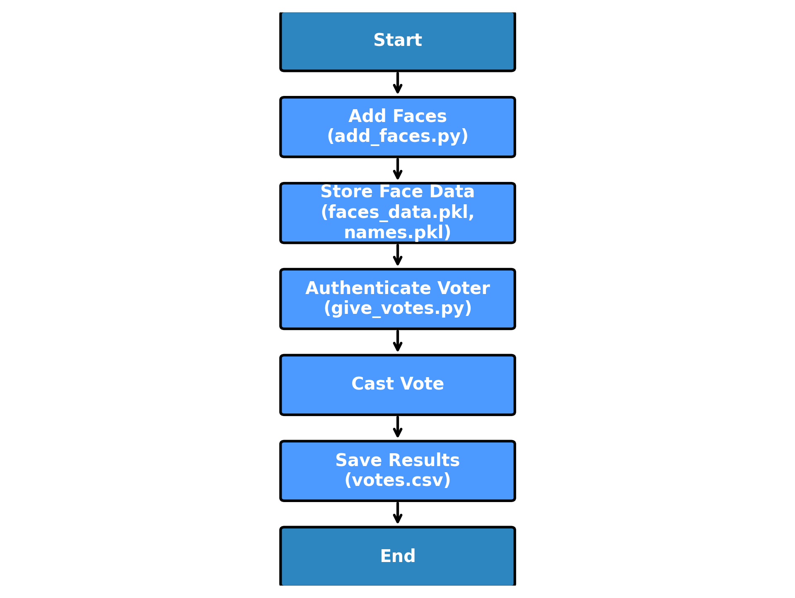

# 🗳️ Smart Voting System using Face Recognition

A Python-based voting system that uses **OpenCV** for face detection and recognition to ensure secure, fraud-free voting.  
The system verifies voter identity through facial data and stores votes securely, preventing duplicate voting.


## Table of Contents
1. [Introduction](#introduction)
2. [Features](#features)
3. [Project Structure](#project-structure)
4. [Installation](#installation)
5. [Usage](#usage)
6. [Flowchart](#flowchart)
7. [Technologies Used](#technologies-used)
8. [Future Improvements](#future-improvements)
9. [License](#license)

## Introduction
The **Smart Voting System using Face Recognition** is an AI-powered application designed to make voting more secure and efficient.  
Instead of traditional voter ID verification, this system uses **facial recognition technology** to authenticate voters and ensure that each person can only vote once.

This project demonstrates:
- Real-time face detection & recognition
- Automatic vote recording
- Data storage for future reference

## Features
- **Face Registration** – Add new voters by capturing their facial data.
- **Face Recognition** – Identify and verify voters in real-time.
- **Secure Voting** – Prevents duplicate votes by storing recognition data.
- **Automatic Vote Counting** – Votes are saved instantly to a CSV file.
- **Simple Interface** – Easy-to-use scripts for adding voters and casting votes.
- **Data Storage** – Stores facial features and voter names in `.pkl` files.

## Project Structure

📂 Smart-Voting-System  
 ├── **add_faces.py** → Script to register new voters by capturing face data.  
 ├── **give_votes.py** → Script to recognize voters and allow them to cast their vote.  
 ├── **requirements.txt** → List of required Python libraries.  
 ├── **votes.csv** → Stores voting results (voter names and their votes).  
 ├── **voting.jpg** → Image used in the interface (optional branding).  
 ├── **faces_data.pkl** → Stores numerical facial data.  
 ├── **names.pkl** → Stores corresponding voter names.


## 📊 Flowchart




## Installation

1. Clone the repository:
   ```bash
   git clone https://github.com/adarshv2403/Smart-Voting-System.git


2.Navigate to the project directory:
cd Smart-Voting-System

3.Install the required dependencies:
pip install -r requirements.txt


---
## Usage

1. **Add Faces for Voting:**
   Run the script to register voters' faces.
   ```bash
   python add_faces.py

2.Start the Voting Process:
python give_votes.py

3.Voting Data:
votes are stored in votes.csv for reference.

## 📊 Output Example

After voting, the `votes.csv` file will look like:

Name,Vote
Alice,Party A
Bob,Party B
Charlie,Party C

## ⚠️ Important Notes

- Do **not** commit real biometric data to GitHub. Files such as `faces_data.pkl`, `names.pkl`, and `votes.csv` can contain sensitive information.
- Ensure proper lighting during face capture for best recognition accuracy.
- Make sure your webcam is functional before running scripts.


## 🛠️ Technologies Used

- **Python 3.x** – Core programming language
- **OpenCV** – Real-time face detection and webcam capture
- **scikit-learn** – Facial recognition and classification
- **pickle** – Storing face encodings and names
- **CSV** – Vote storage for transparency

## 🚀 Future Improvements

- Implement a GUI for better user interaction
- Add live video feed preview during face registration
- Enhance security using encryption for stored facial data
- Deploy as a web-based application for remote voting
- Integrate OTP or multi-factor authentication

## 📜 License

This project is licensed under the **MIT License**. See the [LICENSE](LICENSE) file for details.


